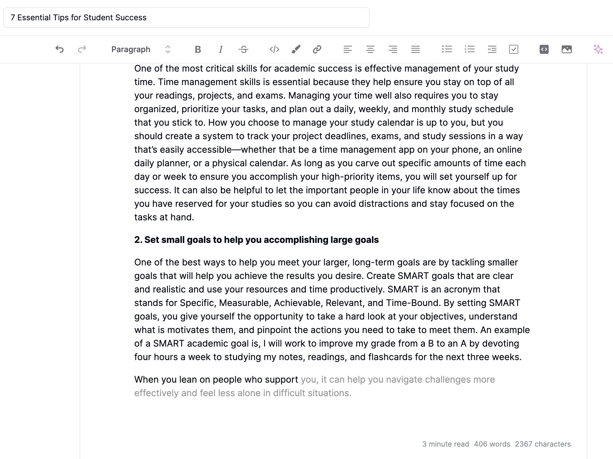
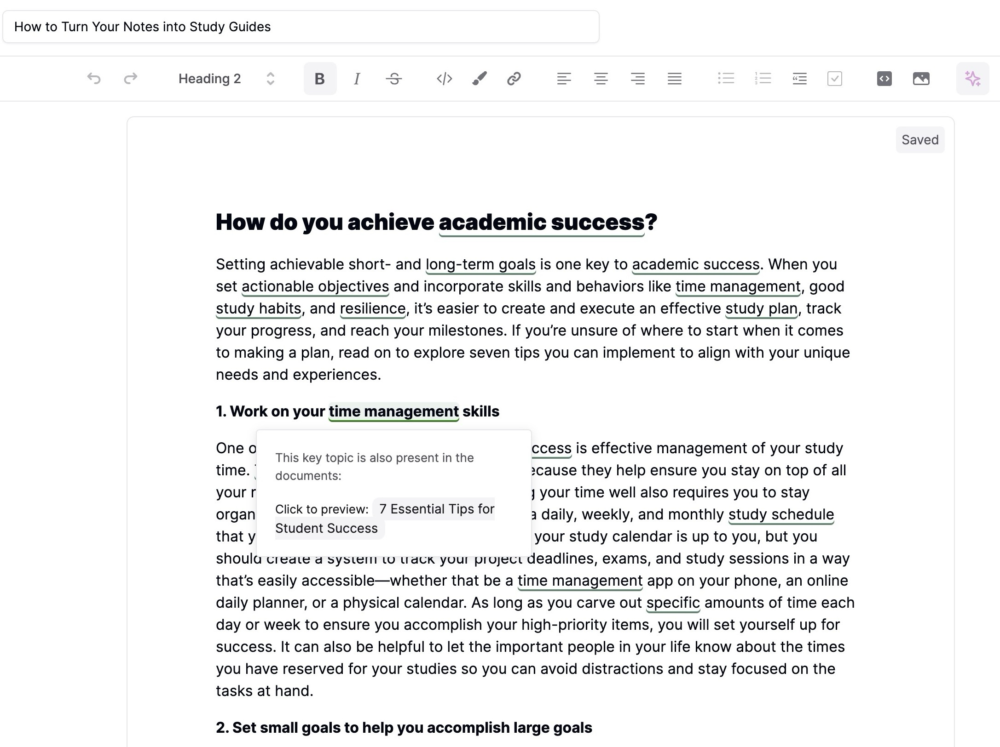
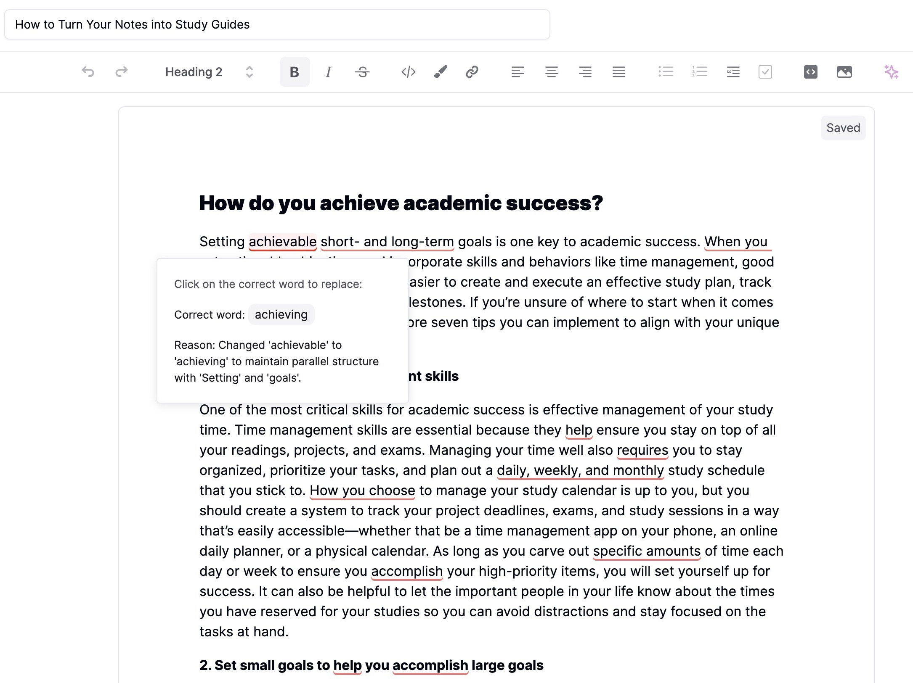

<h1 align="center">Docufy</h1>

<p align="center">
  AI-powered writing and document management platform designed to supercharge your writing process.
</p>

<p align="center">
  <a href="#features"><strong>Features</strong></a> ·
  <a href="#ai-capabilities"><strong>AI Capabilities</strong></a> ·
  <a href="#tech-stack"><strong>Tech Stack</strong></a> ·
  <a href="#getting-started"><strong>Getting Started</strong></a> ·
  <a href="#project-structure"><strong>Project Structure</strong></a> ·
  <a href="#deployment"><strong>Deployment</strong></a>
</p>

## Features

- **Effortless Document Creation:** Write essays, reports, and other documents with ease
- **Efficient Collaboration:** Share your work, enhancing teamwork and productivity
- **AI-powered Enhancements:** Elevate your writing with AI-powered analysis
- **Progress Tracking:** Monitor your writing progress over time
- **Document Management:** Organize and categorize your documents for easy access
- **Version Control:** Track changes and revert to previous versions when needed

## AI Capabilities

**Smart Autocomplete:** Enhance your writing flow with intelligent sentence completion


**Contextual Insights:** Discover related content across your documents for cohesive writing


**Grammar Perfection:** Automatically correct grammar errors for polished writing


## Tech Stack

Docufy is built with modern technologies for optimal performance and developer experience:

- **Frontend**

  - [Next.js 14](https://nextjs.org/) - React framework with App Router
  - [React](https://reactjs.org/) - UI library
  - [Tailwind CSS](https://tailwindcss.com/) - Utility-first CSS framework
  - [Shadcn/ui](https://ui.shadcn.com/) - Accessible component library
  - [Tiptap](https://tiptap.dev/) - Headless rich text editor for document editing
  - [Tremor](https://www.tremor.so/) - React library for dashboards and data visualization

- **State Management**

  - [Zustand](https://github.com/pmndrs/zustand) - Lightweight state management

- **Backend & Database**

  - [Prisma ORM](https://www.prisma.io/) - Type-safe database client
  - [Supabase](https://supabase.com/) - Open source Firebase alternative

- **Authentication**

  - [NextAuth.js](https://next-auth.js.org/) - Authentication for Next.js

- **AI Integration**

  - [OpenAI API](https://openai.com/api/) - AI capabilities

- **Email**
  - [Postmark](https://postmarkapp.com/) - Email delivery service

## Getting Started

### Prerequisites

- Node.js 18.x or later
- npm, yarn, pnpm, or bun

### Installation

1. Clone the repository:

   ```bash
   git clone https://github.com/yourusername/docufy.git
   cd docufy
   ```

2. Install dependencies:

   ```bash
   npm install
   # or
   yarn install
   # or
   pnpm install
   # or
   bun install
   ```

3. Set up environment variables:

   ```bash
   cp .env.example .env.local
   ```

   Edit `.env.local` with your API keys and configuration.

4. Start the development server:

   ```bash
   npm run dev
   # or
   yarn dev
   # or
   pnpm dev
   # or
   bun dev
   ```

5. Open [http://localhost:3000](http://localhost:3000) with your browser to see the result.

## Deployment

### Deploy on Vercel

The easiest way to deploy Docufy is to use the [Vercel Platform](https://vercel.com/new):

1. Push your code to a GitHub repository
2. Import the project to Vercel
3. Vercel will detect Next.js and configure the build settings automatically
4. Your application will be deployed and available at a Vercel URL

## Contributing

Contributions are welcome! Please feel free to submit a Pull Request.

1. Fork the repository
2. Create your feature branch (`git checkout -b feature/amazing-feature`)
3. Commit your changes (`git commit -m 'Add some amazing feature'`)
4. Push to the branch (`git push origin feature/amazing-feature`)
5. Open a Pull Request

## License

This project is licensed under the MIT License - see the [LICENSE](./LICENSE) file for details.
