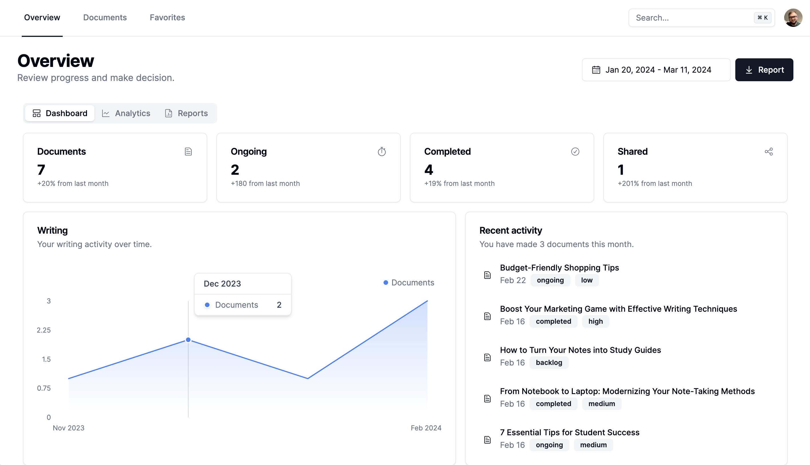

  
  <h1 align="center">Docufy</h1>

<p align="center">
  AI-powered writing and document management platform designed to supercharge your writing process.
</p>

## Getting Started

First, run the development server:

```bash
npm run dev
# or
yarn dev
# or
pnpm dev
# or
bun dev
```

Open [http://localhost:3000](http://localhost:3000) with your browser to see the result.

You can start editing the page by modifying `app/page.tsx`. The page auto-updates as you edit the file.

This project uses [`next/font`](https://nextjs.org/docs/basic-features/font-optimization) to automatically optimize and load Inter, a custom Google Font.

## Features

- **Effortless Document Creation:** Write essays, reports, and other documents with ease.
- **Efficient Collaboration:** Share your work, enhancing teamwork and productivity.
- **AI-powered Enhancements:** Elevate your writing with AI-powered analysis.
- **Progress Tracking:** Monitor your writing progress over time.

## Project Structure

- `app/`: Contains the Next.js pages and components.
- `public/`: Static files like images and the site manifest.
- `styles/`: Global styles and Tailwind CSS configuration.

## Technologies

- **Next.js 14**: For server and client-side rendering.
- **Tailwind CSS**: For styling.
- **Zustand**: For state management.
- **TypeScript**: For type-safe code.
- **Prisma ORM**: For robust database management.
- **OpenAI**: For integrating cutting-edge AI capabilities.
- **NextAuth**: For authorization.
- **Postmark**: For email registration.
- **Supabase**: For database interactions.

## Deploy on Vercel

The easiest way to deploy your Next.js app is to use the [Vercel Platform](https://vercel.com/new?utm_medium=default-template&filter=next.js&utm_source=create-next-app&utm_campaign=create-next-app-readme) from the creators of Next.js.

## License

This project is open-sourced under the MIT License. See the [LICENSE](./LICENSE) file for more details.

## Contributing

Contributions are welcome! Please read our [contributing guidelines](./CONTRIBUTING.md) before submitting pull requests to the project.
